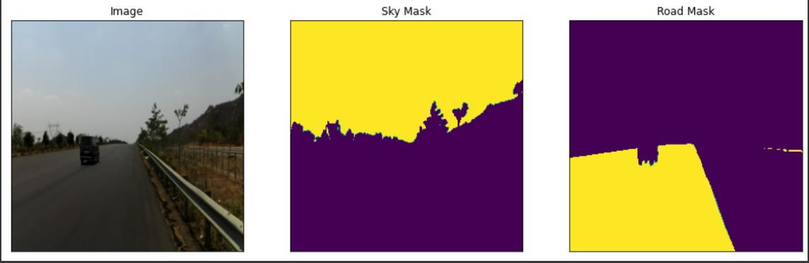
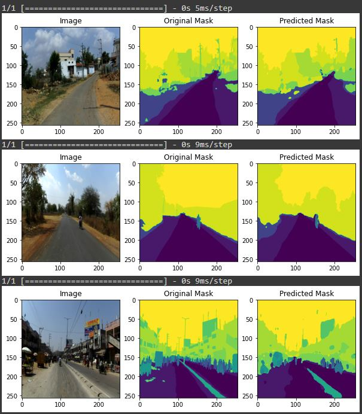
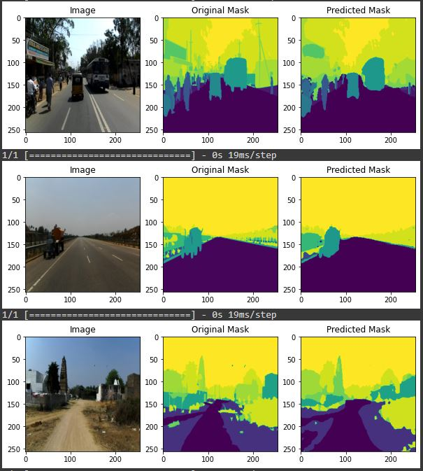

# Indian-Traffic-Segmentation
To perform Semantic(Image) Segmentation of Indian Traffic Images.

## Description:
Semantic segmentation, or image segmentation, is the task of clustering parts of an image together which belong to the same object class. It is a form of pixel-level prediction because each pixel in an image is classified according to a category. This project involves in segmenting the Indian Traffic Images obtained from the video which contains the traffic sites observed in various cities of India. This is implemented using U-Net architecture based Convolutional  Neural Network.

## Ref for U-Net: https://arxiv.org/abs/1505.04597

## Dataset: http://idd.insaan.iiit.ac.in/

  
  <em>Sample Image</em>

## Results:
IOU score for Train and Val Data are **0.4715** and **0.4199**.

  
  
   
  <em>Sample Outputs</em>

## Blog link: https://harishkumar-69065.medium.com/indian-traffic-semantic-segmentation-d4a0062c81fc

## Contains one file and one folder:
* Segmentation.ipynb - Segmentation using U-Net.
* Images Folder.
